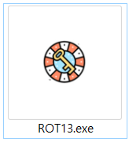
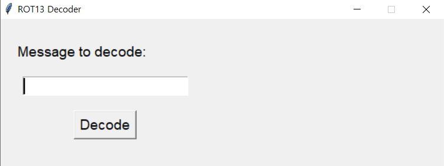
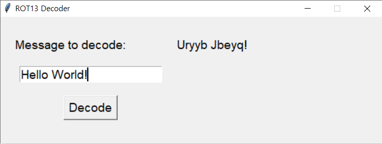

# ROT13 Decoder GUI

This is a simple graphical user interface (GUI) application that allows users to decode a message using the ROT13 encryption method. 

## Prerequisites

To run this application, you need to have Python 3 and the Tkinter library installed on your machine.

## How to run the application

1. Clone this repository to your local machine.
2. Open a terminal or command prompt and navigate to the cloned repository.
3. Type the following command to run the application:

`python ROT13.py`

4. The GUI window should appear on your screen.

## How to use the application

1. Type the message you want to decode in the input field on the left side of the window.
2. Click the "Decode" button to decode the message.
3. The decoded message should appear in the result field on the right side of the window.

## How to create an executable file

If you want to create an executable file (.exe) from this Python script, you can use the PyInstaller library. Here's an example command to create a single-file executable:

`pyinstaller --onefile ROT13.py`

You can also specify an icon file and hide the console window by using the following command:

`pyinstaller --onefile --noconsole --icon=icon.ico ROT13.py`

## How to customize the GUI

If you want to customize the appearance of the GUI, you can modify the `Application` class in the `ROT13.py` file. You can change the font, size, color, and layout of the widgets to suit your needs. 

